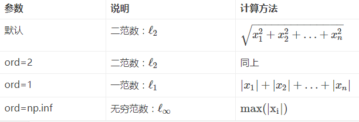

<!--
 * @Author: LIU KANG
 * @Date: 2022-03-13 23:47:19
 * @LastEditors: LIU KANG
 * @LastEditTime: 2022-04-09 15:15:10
 * @FilePath: \PyTorchBase\numpybase\readme.md
 * @Description: 
 * 
 * Copyright (c) 2022 by 用户/公司名, All Rights Reserved. 
-->
#numpy base practice
##参考网站
https://blog.csdn.net/cxmscb/article/details/54583415
###创建ndarry数组

####np.linalg.norm求范数
```
x_norm=np.linalg.norm(x, ord=None, axis=None, keepdims=False)
```
①x: 表示矩阵（也可以是一维）
②ord：范数类型
3.向量的范数
  
###计算方阵的逆np.linalg.inv(x)

##随机数
参考网站：https://blog.csdn.net/sinat_28576553/article/details/82926047
####生成随机整数np.random.randint()
```
temp3=np.random.randint(10,size=8)
temp4=np.random.randint(10,size=(2,4))
temp5=np.random.randint(5,10,size=(2,4))
temp6 = np.random.rand(1,5)
#rand函数根据给定维度生成[0,1)之间的数据，包含0，不包含1
#dn表格每个维度
#返回值为指定维度的array
```
###python 可变参数
参考网站:https://n3xtchen.github.io/n3xtchen/python/2014/08/08/python-args-and-kwargs
*args
```
def argsFunc(a, *args):
	print a
	print args
>>> argsFunc(1, 2, 3, 4)
1
(2, 3, 4)
```
argsFunc 中匹配完定义好的参数，剩余的参数以元组的形式存储在 args（args 名称你可以自行定义），因此在上述程序中只要你传入不小于 1 个参数，该函数都会接受，当然你也可以直接定义只接受可变参数，你就可以自由传递你的参数.
**kwargs
形参名前加两个*表示，参数在函数内部将被存放在以形式名为标识符的 dictionary 中，这时调用函数的方法则需要采用 arg1=value1,arg2=value2 这样的形式。为了区分，我把 *args 称作为数组参数，**kwargs 称作为字典参数
```
>>> def a(**x):print x
>>> a(x=1,y=2,z=3)
{'y': 2, 'x': 1, 'z': 3} #存放在字典中
```
###np.mat和np.array的区别
https://blog.nex3z.com/2017/07/23/numpy-%E4%B8%AD-ndarray-%E5%92%8C-matrix-%E7%9A%84%E5%8C%BA%E5%88%AB/